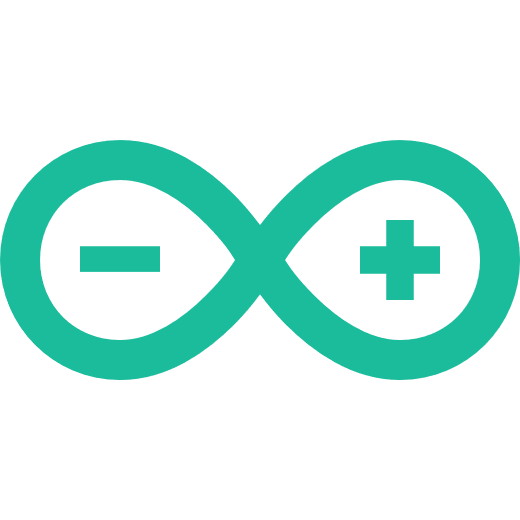

### Hello there, dear internet surfer! 🏄‍
Welcome to my github profile, this is the backend of all my works.
_Yes, you got it, where all of that nerdy magic happens 😏_

I am currently working on many commercial projects, which is why you don't see many repos here.
Mostly, the public repositories that you can find on my profile have to do with sience or astronomy.

### But hey, I haven't presented myself yet! Let me fix that:

- 👨‍⚕️ I am Mattia, but you can call me Matt, I am a Computer Science student in Amsterdam.
- 🤑 I am currently freelancing as a webdeveloper. 
- 🐍 But sometimes I also love to go offline and develop some good old local software, for that purpose I use my beloved python language.

Still interested? Surf a little further on my website then: https://mattiapeiretti.com/, see you there!
Not enough? Here's my: <a href="https://www.instagram.com/mattia.dev/" target="_blank"> Instagram</a>  <a href="https://www.youtube.com/channel/UCdztpA05sJ4dZfg4zgEnPLA" target="_blank"> Youtube</a>

### My skills:

- <a href="https://en.wikipedia.org/wiki/HTML#:~:text=Hypertext%20Markup%20Language%20(HTML)%20is,scripting%20languages%20such%20as%20JavaScript." target="_blank"> HTML</a>
- <a href="https://en.wikipedia.org/wiki/CSS" target="_blank"> CSS</a>
- <a href="https://en.wikipedia.org/wiki/JavaScript" target="_blank"> JavaScript</a>
- <a href="https://vuejs.org/" target="_blank"> Vue</a>
  - <a href="https://nuxtjs.org/" target="_blank"> NuxtJs</a>
- <a href="https://www.figma.com/" target="_blank"> Figma</a>
- <a href="https://wordpress.org/" target="_blank"> Wordpress.org</a>
- <a href="https://www.python.org/" target="_blank"> Python</a>
  - <a href="https://docs.python.org/3/library/tkinter.html" target="_blank"> TkInter</a>
  - <a href="https://opencv.org/" target="_blank"> OpenCV (intermediate)</a>
- <a href="https://www.arduino.cc/" target="_blank"> Arduino</a>
- <a href="https://visualstudio.microsoft.com/" target="_blank"> Visual Studio</a>
- <a href="https://code.visualstudio.com/" target="_blank"> Visual Studio Code</a>
- <a href="https://www.adobe.com/products/premiere.html" target="_blank"> Adobe Premiere Pro</a>
- <a href="https://www.adobe.com/products/photoshop-lightroom.html" target="_blank"> Adobe Lightroom</a>
- <a href="https://trello.com/" target="_blank"> Trello</a>
- <a href="https://notion.so/" target="_blank"> Notion</a>
- <a href="https://www.microsoft.com/en-gb/windows/" target="_blank"> Windows 10</a>
- <a href="https://en.wikipedia.org/wiki/Windows_Server" target="_blank"> Windows Server 2012/2016 (Intermediate)</a>
- <a href="qq.md" target="_blank"> Quantum Computing (Currently Learning)</a>
- <a href=""> Network IT (Currently Learning)</a>
- <a href="https://aws.amazon.com/" target="_blank"> AWS (Currently Learning)</a>
- <a href="https://cloud.google.com/" target="_blank"> GCP (Currently Learning)</a>
- <a href="https://www.raspberrypi.org/" target="_blank"> Raspberry PI (Currently Learning)</a>
- <a href="https://www.linux.org/" target="_blank"> Linux (Currently Learning)</a>

### Planning to learn:

- <a href="https://www.vim.org/" target="_blank"> Vim</a>
- <a href="https://reactjs.org/" target="_blank"> React</a>
- <a href="https://www.djangoproject.com/" target="_blank"> Django</a>
- <a href="https://flask.palletsprojects.com/" target="_blank"> Flask</a>
- <a href="https://en.wikipedia.org/wiki/C%2B%2B" target="_blank"> C++ (Improve)</a>
- <a href="https://docs.microsoft.com/en-us/dotnet/csharp/" target="_blank"> C#</a>
- <a href="https://docs.python.org/3/library/socket.html" target="_blank"> Python Sockets</a>

### Emojis in my commits?!
Well, in order to have a better experience when scrolling though all of those commit messages, I like to categorize them with an emoji!
<ul>
  <li>📦 -> This means that I have added a new feature E.G: 📦 Created feet</li>
  <li>💼 -> This means that I have updated a feature E.G: 💼 Added socks to feet</li>
  <li>🐜 -> This means that I have encountered a bug and fixed it E.G: 🐜 [BUG] Error 404 left sock not found! [SOLUTION] Installed patch for feet router</li>
</ul>

Icons made by <a href="https://icon54.com/" title="Pixel perfect">Pixel perfect</a> <a href="https://www.flaticon.com/authors/freepik" title="Freepik">Freepik</a> from <a href="https://www.flaticon.com/" title="Flaticon">www.flaticon.com</a>

<!--
**MattiaPeiretti/MattiaPeiretti** is a ✨ _special_ ✨ repository because its `README.md` (this file) appears on your GitHub profile.

Here are some ideas to get you started:

- 🔭 I’m currently working on ...
- 🌱 I’m currently learning ...
- 👯 I’m looking to collaborate on ...
- 🤔 I’m looking for help with ...
- 💬 Ask me about ...
- 📫 How to reach me: ...
- 😄 Pronouns: ...
- ⚡ Fun fact: ...
-->
