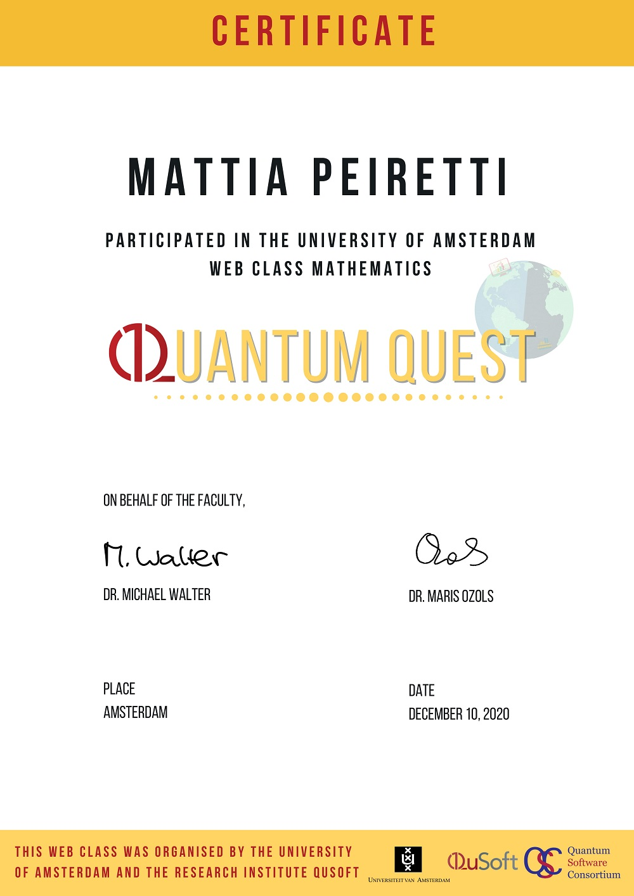

## Quantum Computing

I have followed a course called the Quantum Quest (which unfortunately had to be held online because of the 2020 pandemic) about Quantum Computing.
The course was organized by the [University of Amsterdam](https://en.uva.nl/) and the Dutch research center for quantum software [QuSoft](https://www.qusoft.org/).

The course was an introductory course of the matemathics and algorythm creation of the quantum computing realm.
It's possible to find out more on the offical website of the [Quantum Quest](http://quantum-quest.nl/).

I passed the course as one of the best students, and I have recieved the following certificate:

